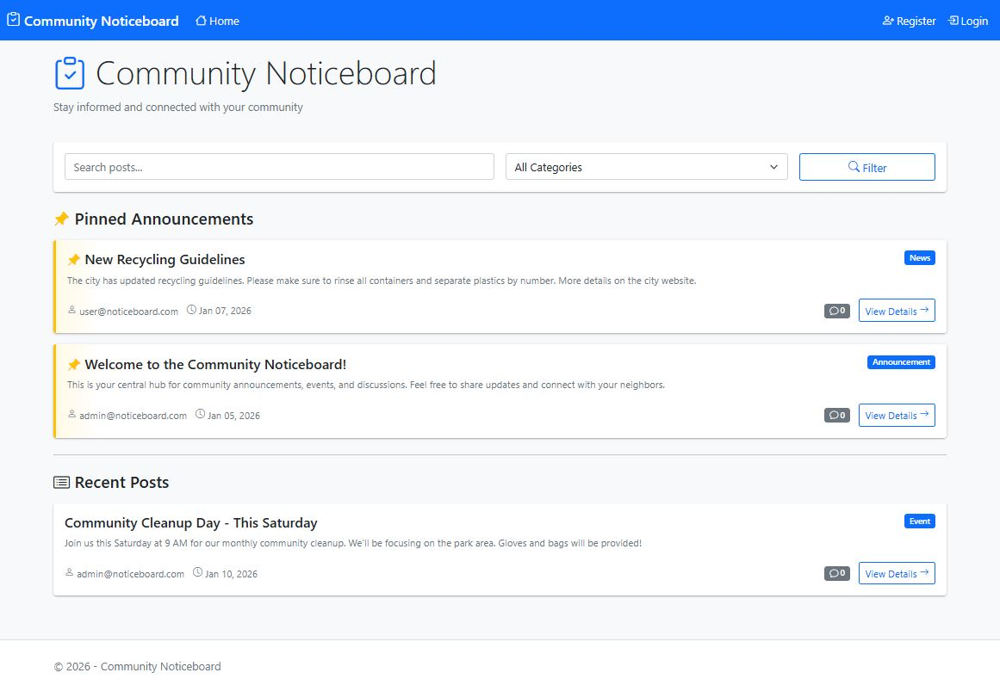

# Community Noticeboard

## Features
- User authentication and role-based authorization
- Create, edit, and delete posts with categories
- Comment system for community engagement
- Admin controls for pinning important announcements
- Search and filter functionality
- Responsive design for mobile and desktop

## Tech Stack
- **Backend:** ASP.NET Core 8 MVC
- **Database:** Entity Framework Core with SQLite/SQL Server
- **Authentication:** ASP.NET Core Identity
- **Frontend:** Razor Views, Bootstrap 5, Bootstrap Icons
- **Architecture:** MVC with ViewModels pattern

## How to Run
1. Clone the repository
2. Run `dotnet restore`
3. Run `dotnet ef database update`
4. Run `dotnet run`
5. Navigate to `https://localhost:XXXX`

## Test Credentials
- Admin: admin@noticeboard.com / Admin@123
- User: user@noticeboard.com / User@123

## Screenshots

